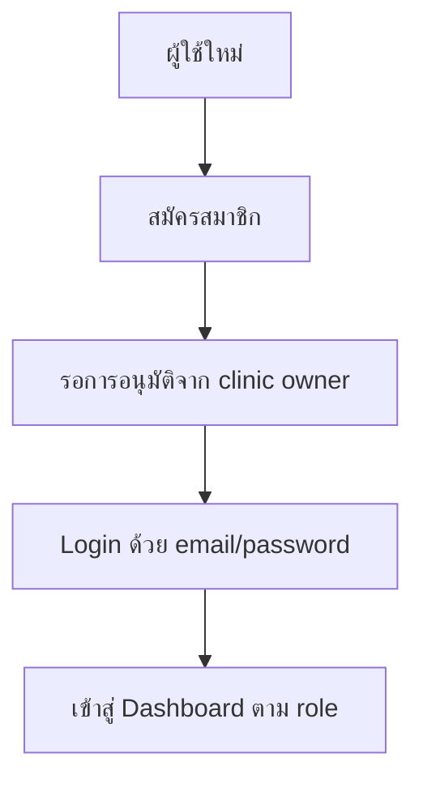
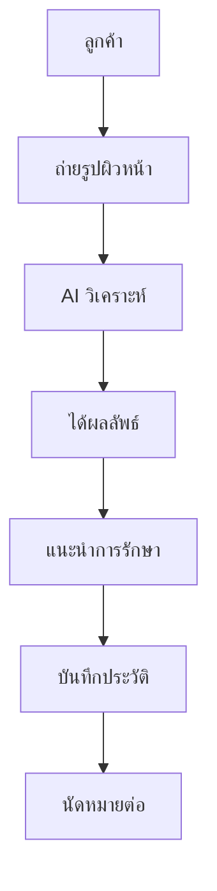
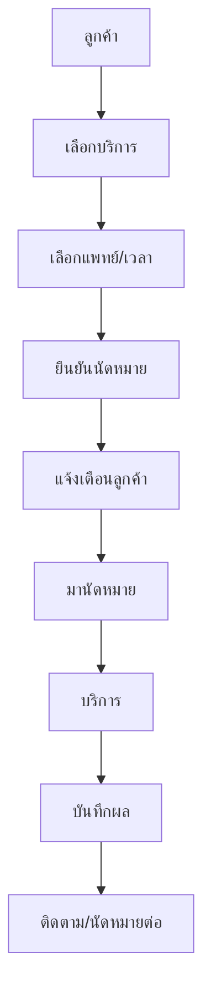

# Beauty with AI Precision - Project Documentation

## 📋 ภาพรวมโปรเจค

**Beauty with AI Precision** เป็นแพลตฟอร์มคลินิกความงามอัจฉริยะที่ใช้ AI ช่วยวิเคราะห์ผิวหน้าและจัดการคลินิกอย่างครบวงจร พัฒนาด้วย Next.js 16, TypeScript, และ Supabase

---

## 🎯 วัตถุประสงค์หลัก

- **วิเคราะห์ผิวหน้า** ด้วย AI/Computer Vision แบบ real-time
- **จัดการคลินิก** ตั้งแต่นัดหมาย ลูกค้า พนักงาน สต็อก
- **ระบบสมาชิก** แบบ multi-role (clinic owner, staff, admin)
- **รายงานและ analytics** สำหรับการตัดสินใจทางธุรกิจ

---

## 🏗️ สถาปัตยกรรมระบบ

### Frontend Stack
- **Next.js 16** (App Router)
- **TypeScript** (Strict mode)
- **TailwindCSS** + **shadcn/ui** components
- **React Hook Form** + **Zod** validation
- **i18n** (Thai/English)

### Backend Stack
- **Supabase** (PostgreSQL + Auth + Storage)
- **API Routes** (Next.js serverless)
- **Edge Functions** (สำหรับ AI processing)

### AI & Computer Vision
- **Google Gemini 2.0 Flash** (Vision API)
- **OpenAI GPT-4 Vision** (Backup)
- **TensorFlow.js** (Client-side analysis)
- **DeepFace** (Face detection)

---

## 🌟 ฟีเจอร์หลัก

### 1. 🤖 AI Skin Analysis
```
อัปโหลดรูป → AI วิเคราะห์ → ผลลัพธ์แบบ real-time
- ตรวจจับปัญหาผิว: สิว, ริ้วรอยดวงตา, จุดด่าง, รูขุมขน
- คำนวณคะแนนความรุนแรง (0-100%)
- แนะนำการรักษาแบบ personalized
- เก็บประวัติการวิเคราะห์
```

### 2. 📅 ระบบนัดหมาย
```
การจัดการนัดหมายครบวงจร:
- ตารางนัดหมายแพทย์/ห้องตรวจ
- การจองคิวออนไลน์
- การเปลี่ยนวัน/เวลา
- ระบบแจ้งเตือน (SMS/Email)
- สถานะนัดหมาย (confirmed, completed, cancelled)
```

### 3. 👥 ระบบสมาชิก & Roles
```
Multi-role Authentication:
├── 🏥 clinic_owner
│   ├── จัดการคลินิก
│   ├── ดูรายงานทั้งหมด
│   └── จัดการพนักงาน
├── 👨‍⚕️ clinic_staff
│   ├── จัดการนัดหมาย
│   ├── บริการลูกค้า
│   └── ดูประวัติลูกค้า
├── 💊 clinic_admin
│   ├── จัดการสต็อก/อุปกรณ์
│   ├── รายงานสินค้า
│   └── จัดการซัพพลายเออร์
└── 🔧 super_admin
    ├── จัดการระบบทั้งหมด
    ├── ดูคลินิกทั้งหมด
    └── ตั้งค่าระบบ
```

### 4. 📊 CRM & Sales
```
การจัดการลูกค้า:
- Sales leads และ proposals
- Customer journey tracking
- Treatment history
- Follow-up scheduling
- Revenue tracking
```

### 5. 📦 สต็อก & อุปกรณ์
```
จัดการสินค้าคงคลัง:
- สต็อกผลิตภัณฑ์ความงาม
- อุปกรณ์ทางการแพทย์
- การโอนย้ายสินค้าระหว่างสาขา
- Low stock alerts
- รายงานสต็อก
```

### 6. 📈 รายงาน & Analytics
```
Dashboard สำหรับแต่ละ role:
├── 📊 Business Overview
│   ├── รายได้/ค่าใช้จ่าย
│   ├── จำนวนลูกค้า
│   └── ประสิทธิภาพการบริการ
├── 👥 Staff Performance
│   ├── นัดหมายต่อวัน
│   ├── ความพึงพอใจลูกค้า
│   └── ยอดขาย
└── 🧴 Product Analytics
    ├── สินค้าขายดี
    ├── สต็อกหมุนเวียน
    └── กำไรต่อสินค้า
```

---

## 🔧 การทำงานของระบบ

### Flow การใช้งานหลัก

#### 1. การลงทะเบียน & Login


#### 2. การวิเคราะห์ผิวหน้า


#### 3. การจัดการนัดหมาย


---

## 🗄️ โครงสร้างฐานข้อมูล

### Tables หลัก
```sql
-- ผู้ใช้และการยืนยันตัวตน
users, auth.users, profiles

-- คลินิกและสาขา  
clinics, branches, staff_assignments

-- นัดหมายและบริการ
appointments, appointment_services, doctor_availability

-- การวิเคราะห์ผิว
skin_analyses, analysis_results, ai_concerns

-- ลูกค้าและ CRM
customers, sales_leads, sales_proposals

-- สต็อกและสินค้า
products, inventory, stock_transfers

-- การชำระเงิน
payments, subscriptions, billing
```

---

## 🔐 ความปลอดภัย

### Authentication & Authorization
- **Supabase Auth** - JWT tokens, refresh tokens
- **Row Level Security (RLS)** - การเข้าถึงข้อมูลตาม role
- **Middleware** - ตรวจสอบ session ทุก request
- **API Rate Limiting** - ป้องกันการใช้งานเกินขีดจำกัด

### Data Protection
- **Encryption** - ข้อมูล sensitive เข้ารหัส
- **Audit Logs** - บันทึกการทำงานทั้งหมด
- **Backup** - สำรองข้อมูลอัตโนมัติ
- **GDPR Compliance** - จัดการข้อมูลส่วนบุคคล

---

## 🚀 Deployment & Infrastructure

### Development
- **Local**: `pnpm dev` (port 3004)
- **Database**: Supabase local development
- **Environment**: `.env.local` สำหรับ API keys

### Production
- **Frontend**: Vercel (Next.js)
- **Backend**: Supabase (PostgreSQL)
- **Storage**: Supabase Storage + CDN
- **Monitoring**: Sentry + Vercel Analytics

### Environment Variables
```env
# Supabase
NEXT_PUBLIC_SUPABASE_URL=...
SUPABASE_SERVICE_ROLE_KEY=...

# AI Services
OPENAI_API_KEY=...
ANTHROPIC_API_KEY=...
GEMINI_API_KEY=...

# Features
NEXT_PUBLIC_ENABLE_AI=true
```

---

## 📱 Responsive Design

### Mobile First
- **Mobile**: 320px - 768px
- **Tablet**: 768px - 1024px  
- **Desktop**: 1024px+

### Key Components
- **Dashboard** - Grid layout สำหรับ mobile
- **Forms** - Touch-friendly inputs
- **Tables** - Horizontal scroll บน mobile
- **Modals** - Full screen บน mobile

---

## 🧪 Testing

### Test Coverage
- **Unit Tests** - Core business logic
- **Integration Tests** - API endpoints
- **E2E Tests** - Critical user journeys
- **Visual Tests** - UI consistency

### Test Commands
```bash
pnpm test          # Unit tests
pnpm test:e2e      # E2E tests  
pnpm test:visual   # Visual tests
```

---

## 🔄 การพัฒนาต่อ

### Roadmap (Q1 2026)
1. **Mobile App** - React Native
2. **AI Model Training** - Custom skin analysis
3. **Telemedicine** - Video consultations
4. **Multi-location** - Chain management
5. **API Marketplace** - Third-party integrations

### Contributing
- **Git Flow** - Feature branches
- **Code Review** - Pull requests
- **Documentation** - Always updated
- **Testing** - Required for all features

---

## 📞 การติดต่อ

### Team
- **Frontend**: Next.js/React developers
- **Backend**: Supabase/Node.js developers  
- **AI/ML**: Computer vision engineers
- **UI/UX**: Design system maintainers

### Support
- **Documentation**: `/docs` folder
- **Issues**: GitHub Issues
- **Discussions**: GitHub Discussions
- **Emergency**: Direct contact team

---

## 📊 Performance Metrics

### KPIs
- **Page Load**: < 2 seconds
- **AI Analysis**: < 10 seconds
- **API Response**: < 500ms
- **Uptime**: 99.9%
- **User Satisfaction**: > 4.5/5

### Monitoring
- **Sentry** - Error tracking
- **Vercel Analytics** - Performance
- **Supabase Logs** - Database queries
- **Custom Dashboard** - Business metrics

---

*เอกสารนี้อัปเดตล่าสุด: 1 มกราคม 2026*
