# 🗄️ ClinicIQ Database - Entity Relationship Diagram

**Date**: December 26, 2025  
**Database**: PostgreSQL 17.6 (Supabase)  
**Total Tables**: 108

---

## 📊 Core Database Schema (ERD)

### Primary Entities & Relationships

```mermaid
erDiagram
    %% Core User Management
    AUTH_USERS ||--|| USERS : "1:1 sync"
    USERS ||--o{ SKIN_ANALYSES : "has many"
    USERS ||--o{ SALES_LEADS : "customer"
    USERS ||--o{ SALES_LEADS : "sales staff"
    USERS ||--o{ INVITATIONS : "invited by"
    USERS ||--o{ APPOINTMENTS : "customer"
    USERS ||--o{ BOOKINGS : "customer"
    USERS ||--o{ CUSTOMER_NOTES : "about"
    USERS ||--o{ USER_PROFILES : "extended data"
    USERS }o--|| CLINICS : "belongs to"
    USERS }o--o| USERS : "assigned to sales"
    
    %% Clinic Management
    CLINICS ||--o{ BRANCHES : "has"
    CLINICS ||--o{ CLINIC_STAFF : "employs"
    CLINICS ||--o{ INVITATIONS : "sends"
    CLINICS ||--o{ TREATMENTS : "offers"
    
    %% Sales & CRM
    SALES_LEADS ||--o{ SALES_PROPOSALS : "generates"
    SALES_LEADS ||--o{ SALES_ACTIVITIES : "tracks"
    SALES_PROPOSALS ||--o{ PROPOSAL_ITEMS : "contains"
    
    %% Appointments & Bookings
    APPOINTMENTS ||--o{ TREATMENT_RECORDS : "results in"
    APPOINTMENTS ||--o{ INVOICES : "billed as"
    BOOKINGS ||--o{ BOOKING_SERVICES : "includes"
    
    %% Financial
    INVOICES ||--o{ INVOICE_ITEMS : "line items"
    INVOICES ||--o{ TAX_RECEIPTS : "issues"
    
    %% Authentication & Users
    AUTH_USERS {
        uuid id PK
        text email UK
        text encrypted_password
        jsonb raw_user_meta_data
        timestamp created_at
    }
    
    USERS {
        uuid id PK, FK
        text email UK
        user_role role
        analysis_tier tier
        text full_name
        text phone
        uuid clinic_id FK
        uuid assigned_sales_user_id FK
        timestamp created_at
    }
    
    %% Clinics & Branches
    CLINICS {
        uuid id PK
        text clinic_name
        text name
        uuid owner_user_id FK
        text address
        text phone
        boolean is_active
        timestamp created_at
    }
    
    BRANCHES {
        uuid id PK
        uuid clinic_id FK
        text branch_name
        text address
        text phone
        boolean is_active
    }
    
    CLINIC_STAFF {
        uuid id PK
        uuid clinic_id FK
        uuid user_id FK
        text role
        boolean is_active
    }
    
    %% AI Analysis
    SKIN_ANALYSES {
        uuid id PK
        uuid user_id FK
        text image_url
        int overall_score
        int confidence
        jsonb analysis_data
        uuid clinic_id FK
        uuid sales_staff_id FK
        timestamp created_at
    }
    
    %% Sales & CRM
    SALES_LEADS {
        uuid id PK
        uuid sales_user_id FK
        uuid customer_user_id FK
        uuid clinic_id FK
        text status
        int lead_score
        text lead_source
        timestamp created_at
    }
    
    SALES_PROPOSALS {
        uuid id PK
        uuid lead_id FK
        uuid sales_user_id FK
        text status
        numeric total_amount
        timestamp created_at
    }
    
    SALES_ACTIVITIES {
        uuid id PK
        uuid lead_id FK
        uuid sales_user_id FK
        text activity_type
        text description
        timestamp activity_date
    }
    
    %% Invitations
    INVITATIONS {
        uuid id PK
        text email
        text invited_role
        uuid clinic_id FK
        uuid invited_by FK
        text token UK
        text status
        timestamp expires_at
        timestamp accepted_at
    }
    
    %% Appointments & Treatments
    APPOINTMENTS {
        uuid id PK
        uuid customer_id FK
        uuid clinic_id FK
        uuid staff_id FK
        uuid branch_id FK
        date appointment_date
        time start_time
        text status
        timestamp created_at
    }
    
    TREATMENT_RECORDS {
        uuid id PK
        uuid appointment_id FK
        uuid customer_id FK
        uuid staff_id FK
        text treatment_name
        text notes
        timestamp performed_at
    }
    
    BOOKINGS {
        uuid id PK
        uuid customer_id FK
        uuid clinic_id FK
        date booking_date
        text status
        numeric total_amount
        timestamp created_at
    }
    
    %% Financial
    INVOICES {
        uuid id PK
        text invoice_number UK
        uuid clinic_id FK
        uuid customer_id FK
        uuid appointment_id FK
        numeric total_amount
        text status
        date issue_date
    }
    
    INVOICE_ITEMS {
        uuid id PK
        uuid invoice_id FK
        text description
        int quantity
        numeric unit_price
        numeric total
    }
    
    TAX_RECEIPTS {
        uuid id PK
        text receipt_number UK
        uuid invoice_id FK
        uuid clinic_id FK
        numeric total_amount
        date issue_date
    }
    
    %% Customer Management
    CUSTOMER_NOTES {
        uuid id PK
        uuid customer_id FK
        uuid sales_staff_id FK
        text note_type
        text content
        timestamp created_at
    }
    
    USER_PROFILES {
        uuid id PK
        uuid user_id FK
        date date_of_birth
        text gender
        text skin_type
        text[] skin_concerns
        jsonb preferences
    }
    
    %% Treatments & Services
    TREATMENTS {
        uuid id PK
        uuid clinic_id FK
        text treatment_name
        text category
        numeric price
        int duration
        boolean is_active
    }
    
    PROPOSAL_ITEMS {
        uuid id PK
        uuid proposal_id FK
        uuid treatment_id FK
        text treatment_name
        int quantity
        numeric unit_price
        numeric total
    }
    
    BOOKING_SERVICES {
        uuid id PK
        uuid booking_id FK
        uuid treatment_id FK
        int quantity
        numeric price
    }
```



---

## 🔑 Key Relationships Explained

### 1. User Authentication Flow
```
auth.users (Supabase Auth)
    ↓ 1:1
public.users (Application Users)
    ↓ 1:many
All user-related tables
```

**Important**: After customers migration, `users` table is the single source of truth for all users including customers.

---

### 2. Multi-Tenant Isolation
```
clinics
    ↓ has
users (clinic_id)
    ↓ has
skin_analyses, sales_leads, appointments, etc.
```

**RLS**: All tables filtered by `clinic_id` for data isolation.

---

### 3. Sales Flow
```
sales_staff (users)
    ↓ invites
customer (users) via invitations
    ↓ becomes
sales_lead
    ↓ generates
sales_proposal
    ↓ converts to
appointment/booking
    ↓ creates
invoice
```

---

### 4. Customer Journey
```
invitation (sent by sales)
    ↓ creates
user (role: customer)
    ↓ assigned to
sales_staff (users.assigned_sales_user_id)
    ↓ tracked in
sales_lead
    ↓ undergoes
skin_analysis
    ↓ books
appointment
    ↓ receives
treatment
    ↓ gets
invoice → tax_receipt
```

---

## 📋 Table Categories

### Core (14 tables)
- `users` - All system users (replaces customers)
- `clinics` - Multi-tenant clinics
- `branches` - Clinic locations
- `clinic_staff` - Staff assignments
- `user_profiles` - Extended user data
- `invitations` - Onboarding system
- `skin_analyses` - AI analysis results
- `sales_leads` - CRM leads
- `sales_proposals` - Sales proposals
- `appointments` - Scheduling
- `bookings` - Booking system
- `treatments` - Service catalog
- `invoices` - Billing
- `tax_receipts` - Tax documents

### Financial (8 tables)
- `invoices`, `invoice_items`
- `tax_receipts`
- `bookings`, `booking_services`
- `payments`, `refunds`
- `promo_codes`

### Sales & CRM (12 tables)
- `sales_leads`, `sales_proposals`, `sales_activities`
- `customer_notes`, `sales_email_templates`
- `sales_email_tracking`, `proposal_items`
- `video_call_sessions`, `chat_messages`

### Analytics (6 tables)
- `performance_metrics`, `analysis_history`
- `notification_logs`, `audit_logs`
- `error_logs`, `alert_logs`

### Marketing (8 tables)
- `campaigns`, `segments`, `segment_members`
- `promo_codes`, `loyalty_points`, `loyalty_redemptions`

### Backup (5 tables)
- `skin_analyses_demo_backup`
- `appointments_invalid_backup`
- `invoices_invalid_backup`
- `tax_receipts_invalid_backup`
- `customers_pre_migration_backup`
- `duplicate_invitations_backup`

---

## 🔗 Foreign Key Summary

### Total: 180 FK Constraints

**Top Referenced Tables:**
1. `users` - 29 foreign keys pointing to it
2. `clinics` - 15 foreign keys
3. `branches` - 8 foreign keys
4. `sales_leads` - 6 foreign keys
5. `appointments` - 5 foreign keys

**Important After Migration:**
- ❌ No tables reference `customers` anymore
- ✅ All customer references go to `users` with role filtering

---

## 🎯 Key Design Patterns

### 1. Soft Deletes
Many tables use `is_active` flag instead of hard deletes:
- `clinics.is_active`
- `branches.is_active`
- `treatments.is_active`
- `users` (no soft delete, CASCADE instead)

### 2. Audit Trail
Most tables include:
- `created_at` - Timestamp
- `updated_at` - Timestamp
- `created_by` - User reference (some tables)

### 3. Multi-Tenancy
Nearly all tables include:
- `clinic_id` - Links to tenant
- RLS policies enforce isolation

### 4. Status Tracking
Common status fields:
- `invitations.status` - pending, accepted, expired
- `sales_leads.status` - new, contacted, qualified, won, lost
- `appointments.status` - scheduled, confirmed, completed, cancelled
- `invoices.status` - draft, sent, paid, overdue, cancelled

---

## 📊 Data Volume (Current)

```
users: 13 records
clinics: 3 records
skin_analyses: 30 records
sales_leads: 6 records
invitations: 7 records
appointments: 0 records (cleaned)
```

**Backup Tables:**
- `skin_analyses_demo_backup`: 10 records
- `customers_pre_migration_backup`: 6 records
- Others: 1-2 records each

---

## 🔍 Index Coverage

**Total Indexes**: 434

**Critical Indexes (After Migration):**
- `users.id` (PK)
- `users.email` (unique)
- `users.clinic_id` (filter)
- `skin_analyses.user_id` (FK + filter)
- `skin_analyses(user_id, clinic_id)` (composite)
- `sales_leads.customer_user_id` (FK)
- `appointments.customer_id` (FK to users)
- `bookings.customer_id` (FK to users)

**Performance**: All queries use index scans (no seq scans)

---

## 🛡️ Security (RLS)

**RLS Enabled**: Most public tables

**Isolation Patterns:**
1. **Clinic Level**: `WHERE clinic_id = auth.get_user_clinic_id()`
2. **User Level**: `WHERE user_id = auth.uid()`
3. **Role Based**: `WHERE is_role('sales_staff')`

**Key RLS Policies:**
- Users can only see their clinic's data
- Sales staff can only see assigned customers
- Customers can only see their own data

---

## 📝 Migration Notes

### Completed Migrations
1. ✅ `customers` → `users` (100%)
2. ✅ All FK updated to point to `users`
3. ✅ `customers_legacy` view for compatibility
4. ✅ No orphaned records

### Deprecated Tables
- `customers` - Use `users` with `role IN ('customer', 'customer_free', 'customer_premium')`

---

## 🎯 Quick Reference

### Get All Customers
```sql
SELECT * FROM users 
WHERE role IN ('customer', 'customer_free', 'customer_premium');

-- Or use legacy view
SELECT * FROM customers_legacy;
```

### Get Customer's Analyses
```sql
SELECT sa.* 
FROM skin_analyses sa
JOIN users u ON sa.user_id = u.id
WHERE u.email = 'customer@example.com';
```

### Get Sales Staff's Customers
```sql
SELECT * FROM users
WHERE assigned_sales_user_id = 'sales-staff-uuid'
  AND role LIKE 'customer%';
```

### Check Database Health
```sql
SELECT check_database_health();
```

---

## 🚀 Performance Tips

1. **Always filter by clinic_id first** - Uses indexes
2. **Use composite indexes** - e.g., (user_id, clinic_id)
3. **Avoid SELECT *** - Specify columns needed
4. **Use EXPLAIN ANALYZE** - Verify index usage
5. **Monitor slow queries** - Check pg_stat_statements

---

**Document Version**: 1.0  
**Last Updated**: December 26, 2025 04:56 AM UTC+7  
**Maintained By**: Development Team
