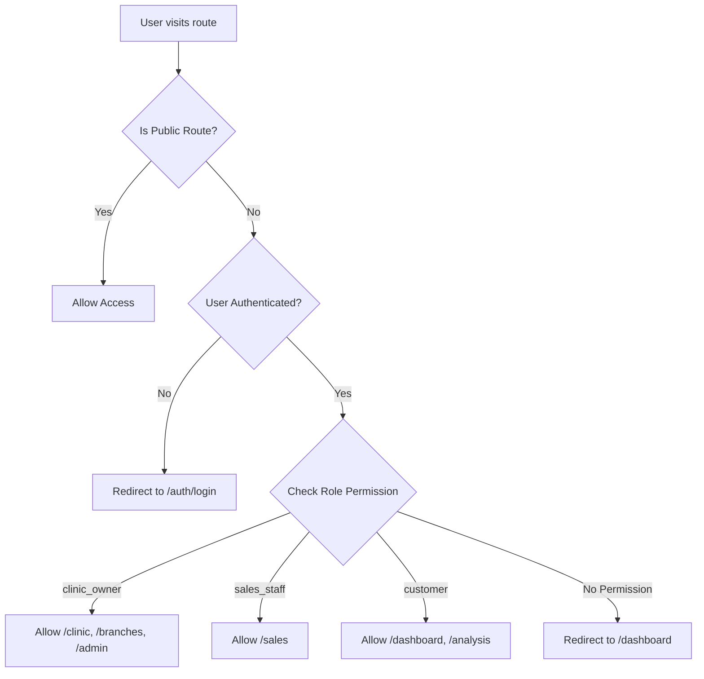

# 🗺️ Routes Structure - Beauty with AI Precision

เอกสารสรุปเส้นทาง (Routes) ทั้งหมดในโปรเจค แยกตาม Role และหน้าที่การใช้งาน

**Last Updated:** November 9, 2025

---

## 📋 Table of Contents

- [Public Routes (ไม่ต้อง Login)](#public-routes)
- [Customer Routes (ลูกค้าทั่วไป)](#customer-routes)
- [Clinic Owner Routes](#clinic-owner-routes)
- [Sales Staff Routes](#sales-staff-routes)
- [Super Admin Routes](#super-admin-routes)
- [Protected Routes Summary](#protected-routes-summary)
- [API Routes](#api-routes)

---

## 🌐 Public Routes (ไม่ต้อง Login)

### Landing & Marketing Pages
| Route | Description | Component |
|-------|-------------|-----------|
| `/` | หน้าแรก Landing Page | `app/page.tsx` |
| `/features` | แสดงฟีเจอร์ทั้งหมด | `app/features/page.tsx` |
| `/pricing` | แผนราคาและแพ็กเกจ | `app/pricing/page.tsx` |
| `/faq` | คำถามที่พบบ่อย | `app/faq/page.tsx` |
| `/contact` | ติดต่อเรา | `app/contact/page.tsx` |
| `/about` | เกี่ยวกับเรา | `app/about/page.tsx` |
| `/demo` | Demo ระบบ | `app/demo/page.tsx` |

### Legal Pages
| Route | Description | Component |
|-------|-------------|-----------|
| `/privacy` | นโยบายความเป็นส่วนตัว | `app/privacy/page.tsx` |
| `/terms` | ข้อกำหนดการใช้งาน | `app/terms/page.tsx` |
| `/pdpa` | PDPA Consent | `app/pdpa/page.tsx` |
| `/security` | ความปลอดภัย | `app/security/page.tsx` |

### Authentication Routes
| Route | Description | Component |
|-------|-------------|-----------|
| `/auth/login` | หน้า Login | `app/[locale]/auth/login/page.tsx` |
| `/auth/sign-up` | สมัครสมาชิก | `app/auth/sign-up/page.tsx` |
| `/auth/error` | Error page | `app/auth/error/page.tsx` |

### Public Analysis (Demo)
| Route | Description | Component |
|-------|-------------|-----------|
| `/analysis` | วิเคราะห์ผิวหน้า (Public) | `app/[locale]/analysis/page.tsx` |
| `/ar-simulator` | AR Simulator (Public) | `app/ar-simulator/page.tsx` |

---

## 👤 Customer Routes (ลูกค้าทั่วไป)

**Role:** `customer`, `user` (default role)

### Navigation Menu Items:
- Analysis (วิเคราะห์ผิว)
- AR Simulator (ทดลอง AR)
- AI Advisor (ปรึกษา AI)
- Booking (จองคิว)

### Main Routes
| Route | Description | Access |
|-------|-------------|--------|
| `/dashboard` | Customer Dashboard | 🔒 Protected |
| `/profile` | โปรไฟล์ส่วนตัว | 🔒 Protected |
| `/analysis` | วิเคราะห์ผิวหน้า | 🌐 Public |
| `/analysis/results` | ผลการวิเคราะห์ | 🔒 Protected |
| `/analysis/history` | ประวัติการวิเคราะห์ | 🔒 Protected |
| `/analysis/detail/[id]` | รายละเอียดการวิเคราะห์ | 🔒 Protected |
| `/analysis/progress` | ติดตามความคืบหน้า | 🔒 Protected |
| `/analysis/multi-angle` | วิเคราะห์หลายมุม | 🔒 Protected |
| `/ar-simulator` | ทดลอง AR Treatment | 🌐 Public |
| `/ar-3d` | AR 3D View | 🔒 Protected |
| `/ar-advanced` | AR Advanced Features | 🔒 Protected |
| `/ar-live` | AR Live Preview | 🔒 Protected |
| `/ai-chat` | ปรึกษา AI Chatbot | 🔒 Protected |
| `/ai-chat-demo` | AI Chat Demo | 🌐 Public |
| `/ai-recommender-demo` | AI Recommender | 🌐 Public |
| `/booking` | จองนัดหมาย | 🔒 Protected |
| `/booking-demo` | Booking Demo | 🌐 Public |
| `/progress` | ติดตามผล | 🔒 Protected |
| `/progress-tracking-demo` | Progress Demo | 🌐 Public |
| `/recommendations` | คำแนะนำ Treatment | 🔒 Protected |
| `/treatment-plans` | แผน Treatment | 🔒 Protected |
| `/payment` | ชำระเงิน | 🔒 Protected |
| `/payment/success` | ชำระเงินสำเร็จ | 🔒 Protected |
| `/loyalty` | โปรแกรมสะสมแต้ม | 🔒 Protected |
| `/onboarding` | Onboarding Flow | 🔒 Protected |
| `/onboarding/customer` | Customer Onboarding | 🔒 Protected |

### Demo & Test Pages
| Route | Description | Access |
|-------|-------------|--------|
| `/product-viewer` | ดูสินค้า 3D | 🌐 Public |
| `/shop-demo` | Shop Demo | 🌐 Public |
| `/mobile-test` | Mobile Responsive Test | 🌐 Public |
| `/pwa-demo` | PWA Demo | 🌐 Public |
| `/i18n-demo` | i18n Demo | 🌐 Public |

---

## 🏥 Clinic Owner Routes

**Role:** `clinic_owner`, `clinic_admin`

### Navigation Menu Items:
- Dashboard (แดชบอร์ด)
- **Branches (🏢 สาขา)** ← NEW
- Customers (ลูกค้า)
- AI Advisor (💬 ปรึกษา AI)
- Analytics (วิเคราะห์)

### Main Routes
| Route | Description | Permission |
|-------|-------------|------------|
| `/clinic/dashboard` | Clinic Dashboard | ✅ Owner/Admin |
| `/branches` | จัดการสาขา | ✅ Owner/Admin/Staff (Read) |
| `/customers` | จัดการลูกค้า | ✅ Owner/Admin |
| `/clinic/staff` | จัดการพนักงาน | ✅ Owner/Admin |
| `/clinic/[clinicId]/queue` | จัดการคิว | ✅ Owner/Admin |
| `/analytics` | Analytics Dashboard | ✅ Owner/Admin |
| `/reports` | รายงาน | ✅ Owner/Admin |
| `/inventory` | จัดการสต็อก | ✅ Owner/Admin |
| `/schedule` | ตารางนัดหมาย | ✅ Owner/Admin |
| `/ai-chat` | AI Advisor | ✅ Owner/Admin |

### Admin Routes
| Route | Description | Permission |
|-------|-------------|------------|
| `/admin` | Admin Panel | ✅ Owner/Super Admin |
| `/admin/errors` | Error Logs | ✅ Owner/Super Admin |
| `/security/audit-logs` | Audit Logs | ✅ Owner/Super Admin |

---

## 💼 Sales Staff Routes

**Role:** `sales_staff`

### Navigation Menu Items:
- Dashboard (แดชบอร์ด)
- Leads (ลูกค้าเป้าหมาย)
- Proposals (ใบเสนอราคา)

### Main Routes
| Route | Description | Features |
|-------|-------------|----------|
| `/sales/dashboard` | Sales Dashboard | 📊 Metrics, Hot Leads, Performance |
| `/sales/leads` | จัดการ Leads | 👥 Lead Management |
| `/sales/leads/[id]` | รายละเอียด Lead | 📝 Lead Details |
| `/sales/proposals` | ใบเสนอราคา | 📄 Proposal Management |
| `/sales/notes` | บันทึกลูกค้า | 📝 Customer Notes |
| `/sales/performance` | ผลงาน Sales | 📈 Performance Metrics |
| `/sales/presentations` | งานนำเสนอ | 📊 Presentation List |
| `/sales/presentation/[id]` | รายละเอียดงานนำเสนอ | 📱 Presentation Details |
| `/sales/mobile-presentation/[id]` | Mobile Presentation | 📱 Mobile-optimized |
| `/sales/wizard/[customerId]` | Sales Wizard | 🧙 Step-by-step Flow |
| `/sales/quick-scan` | Quick Scan | ⚡ Fast Analysis |

### Sales Tools
| Route | Description | Features |
|-------|-------------|----------|
| `/leads` | All Leads (Legacy) | 👥 Lead List |
| `/marketing` | Marketing Tools | 📧 Campaigns, Templates |
| `/campaign-automation` | Campaign Automation | 🤖 Automated Campaigns |
| `/chat` | Chat with Customers | 💬 Real-time Chat |
| `/chat/demo` | Chat Demo | 💬 Chat Interface Demo |

---

## 🔧 Super Admin Routes

**Role:** `super_admin`

### Navigation Menu Items:
- Tenants (องค์กร/คลินิก)
- Users (ผู้ใช้ทั้งหมด)
- Settings (ตั้งค่าระบบ)

### Super Admin Exclusive Routes
| Route | Description | Permission |
|-------|-------------|------------|
| `/super-admin` | Super Admin Dashboard | ✅ Super Admin Only |
| `/users` | จัดการผู้ใช้ทั้งระบบ | ✅ Super Admin Only |
| `/settings` | ตั้งค่าระบบ | ✅ Super Admin Only |

### Admin Tools (Shared with Clinic Owner)
| Route | Description | Permission |
|-------|-------------|------------|
| `/admin` | Admin Dashboard | ✅ Super Admin + Clinic Owner |
| `/admin/websocket` | WebSocket Monitor | ✅ Super Admin + Clinic Owner |
| `/admin/broadcast` | Broadcast Messages | ✅ Super Admin + Clinic Owner |
| `/admin/fix-rls` | Fix RLS Policies | ✅ Super Admin + Clinic Owner |
| `/[locale]/admin/errors` | Error Logs | ✅ Super Admin + Clinic Owner |

**Note:** `/admin/*` routes are accessible by both `super_admin` and `clinic_owner` roles for system administration purposes.
| `/settings` | System Settings | ✅ Super Admin Only |

---

## 🔒 Protected Routes Summary

### Middleware Protection Patterns

```typescript
const PROTECTED_ROUTE_PATTERNS = [
  "/clinic",        // Clinic Owner/Admin/Staff
  "/branches",      // Clinic Owner/Admin/Staff
  "/sales",         // Sales Staff
  "/admin",         // Clinic Owner/Super Admin
  "/dashboard",     // All Authenticated Users
  "/profile",       // All Authenticated Users
  "/booking",       // All Authenticated Users
  "/analysis/history", // All Authenticated Users
  "/ar-simulator",  // All Authenticated Users
]
```

### Role-based Access Control

| Route Pattern | clinic_owner | clinic_admin | clinic_staff | sales_staff | customer | super_admin |
|---------------|--------------|--------------|--------------|-------------|----------|-------------|
| `/clinic/*` | ✅ | ✅ | ✅ | ❌ | ❌ | ❌ |
| `/branches/*` | ✅ (Full) | ✅ (Full) | ✅ (Read) | ❌ | ❌ | ❌ |
| `/sales/*` | ❌ | ❌ | ❌ | ✅ | ❌ | ❌ |
| `/admin/*` | ✅ | ❌ | ❌ | ❌ | ❌ | ✅ |
| `/super-admin` | ❌ | ❌ | ❌ | ❌ | ❌ | ✅ |
| `/users` | ❌ | ❌ | ❌ | ❌ | ❌ | ✅ |
| `/settings` | ❌ | ❌ | ❌ | ❌ | ❌ | ✅ |
| `/dashboard` | ✅ | ✅ | ✅ | ✅ | ✅ | ✅ |
| `/profile` | ✅ | ✅ | ✅ | ✅ | ✅ | ✅ |
| `/analysis/*` | ✅ | ✅ | ✅ | ✅ | ✅ | ✅ |

---

## 🔌 API Routes

### Analysis APIs
| Endpoint | Method | Description |
|----------|--------|-------------|
| `/api/analyze` | POST | วิเคราะห์ผิวหน้า |
| `/api/analyze-image` | POST | วิเคราะห์รูปภาพ |
| `/api/analysis/history` | GET | ประวัติการวิเคราะห์ |
| `/api/analysis/history/[userId]` | GET | ประวัติตาม User |

### Branch Management APIs
| Endpoint | Method | Description |
|----------|--------|-------------|
| `/api/branches` | GET | รายการสาขา |
| `/api/branches` | POST | สร้างสาขาใหม่ |
| `/api/branches/[id]` | GET | รายละเอียดสาขา |
| `/api/branches/[id]` | PATCH | แก้ไขสาขา |
| `/api/branches/[id]` | DELETE | ลบสาขา |
| `/api/branches/[id]/summary` | GET | สรุปข้อมูลสาขา |
| `/api/branches/staff` | GET | พนักงานในสาขา |
| `/api/branches/staff/[id]` | GET/PATCH/DELETE | จัดการพนักงาน |
| `/api/branches/inventory` | GET/POST | สต็อกสินค้า |
| `/api/branches/inventory/[id]` | GET/PATCH/DELETE | จัดการสต็อก |
| `/api/branches/transfers` | GET/POST | Transfer ระหว่างสาขา |
| `/api/branches/transfers/[id]` | GET/PATCH/DELETE | จัดการ Transfer |
| `/api/branches/services` | GET/POST | บริการในสาขา |
| `/api/branches/revenue` | GET | รายได้สาขา |

### Sales APIs
| Endpoint | Method | Description |
|----------|--------|-------------|
| `/api/sales/hot-leads` | GET | Hot Leads |
| `/api/sales/metrics` | GET | Sales Metrics |
| `/api/sales/chat-messages` | GET/POST | Chat Messages |
| `/api/sales/proposals` | GET/POST | Proposals |

### Super Admin APIs
| Endpoint | Method | Description |
|----------|--------|-------------|
| `/api/super-admin/tenants` | GET | รายการ Tenants ทั้งหมด |
| `/api/super-admin/users` | GET | รายการ Users ทั้งหมด |
| `/api/super-admin/settings` | GET/PATCH | ตั้งค่าระบบ |
| `/api/admin/websocket` | GET | WebSocket Status |
| `/api/admin/broadcast` | POST | Broadcast Messages |
| `/api/admin/rls` | POST | Fix RLS Policies |

### Auth & User APIs
| Endpoint | Method | Description |
|----------|--------|-------------|
| `/api/auth/check-role` | GET | ตรวจสอบ Role |
| `/api/auth/logout` | POST | Logout |
| `/api/user/profile` | GET | User Profile |
| `/api/user/settings` | GET/PATCH | User Settings |

### Other APIs
| Endpoint | Method | Description |
|----------|--------|-------------|
| `/api/booking` | GET/POST | Booking |
| `/api/treatments` | GET | Treatments |
| `/api/recommendations` | POST | AI Recommendations |
| `/api/upload` | POST | Upload Images |

---

## 📱 Route Naming Convention

### Pattern Structure:
```
/[role]/[feature]/[action]/[id]
```

### Examples:
- `/sales/leads` - Sales role, Leads feature
- `/sales/leads/123` - Sales role, Lead detail with ID
- `/clinic/dashboard` - Clinic role, Dashboard
- `/branches` - Branches feature (clinic role implied by middleware)
- `/analysis/detail/456` - Analysis detail with ID

---

## 🌍 Localized Routes

Routes ที่รองรับหลายภาษา (i18n):

```
/[locale]/route
```

### Supported Locales:
- `en` - English
- `th` - Thai (ไทย)

### Examples:
- `/en/analysis` - Analysis in English
- `/th/analysis` - วิเคราะห์เป็นภาษาไทย
- `/en/auth/login` - Login in English
- `/th/auth/login` - Login เป็นภาษาไทย

---

## 🚦 Route Access Flow



---

## 📝 Notes

### Branch Management Integration (NEW)
- ✅ Clinic owners can now access `/branches` to manage branches
- ✅ Menu item added to header navigation
- ✅ Middleware updated to allow `clinic_owner`, `clinic_admin`, `clinic_staff`
- ✅ Full CRUD operations available via API

### Testing Routes
Many `/test-*` routes exist for development/testing:
- `/test-ai` - AI Testing
- `/test-treatment-scheduling` - Treatment Scheduling Test
- `/test-product-recommendation` - Product Recommendation Test
- etc.

These are typically not linked in production navigation.

### Demo Routes
Demo routes for showcasing features:
- `/demo` - General demo
- `/demo/ai` - AI Demo
- `/*-demo` - Various feature demos

### Legacy Routes
Some routes may be legacy and redirect to newer routes:
- `/sales/page.tsx` might redirect to `/sales/dashboard`

---

## 🔄 Redirect Rules

### Middleware Redirects:
1. **Unauthenticated + Protected Route** → `/auth/login?redirect=[original-route]`
2. **Wrong Role for Route** → `/dashboard`
3. **Auth Error** → Clear session → Check if protected → Login or continue

### Example Redirect Flow:
```
User: sales_staff tries to access /clinic
↓
Middleware checks role
↓
Role is sales_staff, not clinic_owner/admin/staff
↓
Redirect to /dashboard
```

---

## 📞 Support

For questions about routes or permissions:
- Check middleware: `lib/supabase/middleware.ts`
- Check navigation: `components/header.tsx`
- Check hooks: `hooks/useClinicContext.ts`

---

**Generated by:** AI Development Team  
**Date:** November 9, 2025  
**Project:** Beauty with AI Precision
