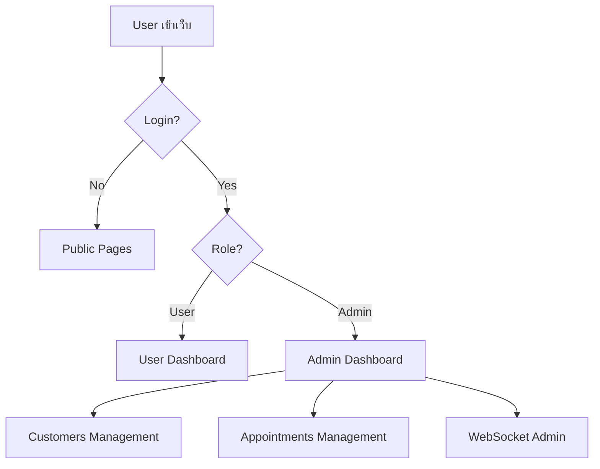

# สรุปเส้นทาง User ทั้งหมดในระบบ

## 🔐 Authentication Routes (4 เส้นทาง)

### 1. Login (เข้าสู่ระบบ)
- **Path**: `/auth/login`
- **File**: `app/auth/login/page.tsx`
- **Provider**: Supabase Auth
- **Status**: ✅ Implemented

### 2. Register (สมัครสมาชิก)
- **Path**: `/auth/register`
- **File**: `app/auth/register/page.tsx`
- **Provider**: Supabase Auth
- **Status**: ✅ Implemented

### 3. Forgot Password (ลืมรหัสผ่าน)
- **Path**: `/auth/forgot-password`
- **File**: `app/auth/forgot-password/page.tsx`
- **Provider**: Supabase Auth
- **Status**: ✅ Implemented

### 4. Reset Password (รีเซ็ตรหัสผ่าน)
- **Path**: `/auth/reset-password`
- **File**: `app/auth/reset-password/page.tsx`
- **Provider**: Supabase Auth
- **Status**: ✅ Implemented

---

## 👥 User Roles (3 ระดับ)

### 1. **Public User** (ผู้ใช้ทั่วไป - ไม่ต้อง login)
- หน้าแรก `/`
- About `/about`
- Features `/features`
- Pricing `/pricing`
- Contact `/contact`
- FAQ `/faq`

### 2. **Authenticated User** (ผู้ใช้ที่ login แล้ว)
- Dashboard `/dashboard`
- Profile `/profile`
- AI Chat `/ai-chat`
- AI Recommender `/ai-recommender-demo`
- Booking `/booking`
- Schedule `/schedule`
- Availability `/availability`
- Payment `/payment`
- Loyalty `/loyalty`
- Progress Tracking `/progress-tracking-demo`

### 3. **Admin User** (ผู้ดูแลระบบ)
- Admin Dashboard `/admin`
- Admin Dashboard (New) `/admin-dashboard`
- **Customers Management** `/admin/customers` ⚠️ NEW
  - View all customers
  - Customer details `/admin/customers/[id]`
  - Add new customer `/admin/customers/new`
- **Appointments Management** `/admin/appointments` ⚠️ NEW
  - Calendar view
  - Appointment details `/admin/appointments/[id]`
- WebSocket Admin `/admin/websocket`
- Broadcast Messages `/admin/broadcast`
- Fix RLS Policies `/admin/fix-rls`

---

## 🆕 ไฟล์ใหม่ที่พบ (ยังไม่ได้ commit)

### Admin Features (Mock Demo Pages)
- `app/admin/appointments/page.tsx` - Appointment calendar with mock data
- `app/admin/appointments/[id]/page.tsx` - Appointment details
- `app/admin/customers/page.tsx` - Customer list with search/filter
- `app/admin/customers/[id]/page.tsx` - Customer profile
- `app/admin/customers/new/page.tsx` - Add new customer form

### API Routes (Mock Backend)
- `app/api/admin/appointments/route.ts` - CRUD appointments
- `app/api/admin/customers/route.ts` - CRUD customers
- `app/api/admin/dashboard/route.ts` - Dashboard stats

### Components
- `components/customers/customers-table.tsx` - Customer data table
- `components/ui/loading.tsx` - Loading spinner component

### Mock Data
- `lib/mock/customer-mock-data.ts` - Sample customer data
- `lib/mock/appointment-mock-data.ts` - Sample appointment data

### Documentation
- `docs/SALES-MODE-QUICK-START.md` - Sales features guide
- `docs/SALES-STRATEGY.md` - Sales strategy
- `docs/VISIA-COMPETITIVE-ANALYSIS.md` - Competitor analysis
- `docs/performance-caching.md` - Caching guide
- `docs/task-4-summary.md` - Task 4 completion
- `docs/task-5-summary.md` - Task 5 (RBX) completion
- `docs/task-6-summary.md` - Task 6 (UV Spots) completion
- `docs/task-7-summary.md` - Task 7 (Porphyrins) completion

---

## ⚠️ ไฟล์ที่ไม่ควรอยู่ใน Git

### 1. node_modules_backup/ (59,759 ไฟล์)
- **ปัญหา**: Backup ของ node_modules ที่มีไฟล์เกือบ 6 หมื่นไฟล์
- **แก้ไข**: เพิ่มใน .gitignore แล้ว → `/node_modules_backup`
- **การดำเนินการ**: ควรลบทิ้งเพราะไม่จำเป็น

### 2. app/[locale]/sales/ (โฟลเดอร์ว่าง)
- **ปัญหา**: Git แสดงว่ามี untracked แต่จริงๆ ไม่มีไฟล์
- **สาเหตุ**: อาจเป็น git cache issue
- **แก้ไข**: ไม่ต้องทำอะไร (folder ไม่มีจริง)

---

## 📊 สรุป Authentication Flow

## ✅ Checklist ก่อน Commit

- [x] เพิ่ม `/node_modules_backup` ใน .gitignore
- [ ] ลบ `node_modules_backup/` folder
- [ ] ตรวจสอบว่า admin pages ทำงานถูกต้อง
- [ ] เพิ่ม authentication guard สำหรับ admin routes
- [ ] ทดสอบ mock data ใน development mode
- [ ] เตรียม production API endpoints (แทน mock data)

---

## 🔒 Security Notes

**ปัจจุบัน**: Admin pages ใช้ mock data (ไม่มี authentication guard)

**ควรทำ**:
1. เพิ่ม middleware `/middleware.ts` เพื่อเช็ค admin role
2. ใช้ Supabase RLS policies ป้องกันการเข้าถึง admin routes
3. เปลี่ยนจาก mock data เป็น Supabase database queries
4. เพิ่ม rate limiting สำหรับ admin API endpoints

---

**สร้างโดย**: AI Analysis
**วันที่**: 2025-11-06
**Status**: ตรวจพบไฟล์ใหม่ 40+ ไฟล์ที่ยังไม่ได้ commit
